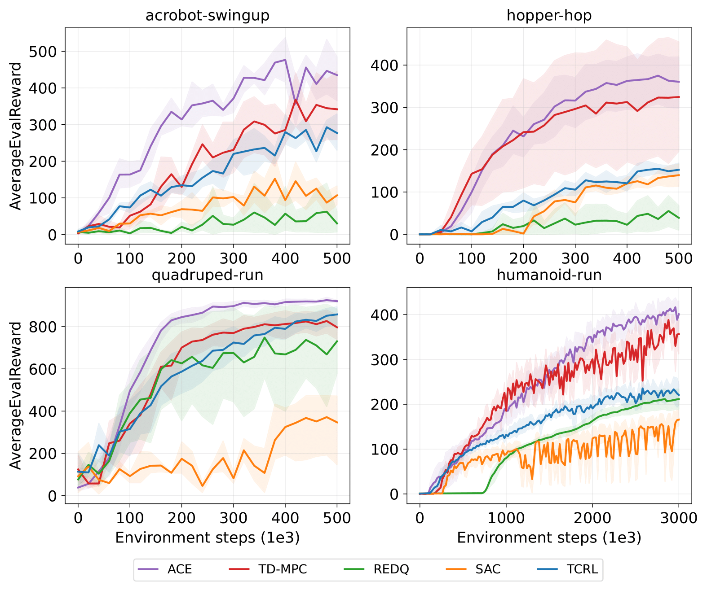

# Learning Off-policy with Model-based Intrinsic Motivation For Active Online Exploration
Original PyTorch implementation of the **ACE Planner**

## method 
**ACE Planner** is a model-based deep reinforcement learning algorithm that seamlessly integrates
online planning and off-policy agent learning for sample-efficient exploration.
Drawing on theoretical insights gained from the performance analysis of an $H$-step lookahead policy coupled with predictive intrinsic rewards, 
we enhance the ACE planner with a novelty-aware terminal value function learned using the exponential reweighted MVE-based value estimator. 
By employing the active exploration schema, our approach demonstrates remarkable sample efficiency in mastering challenging continuous control tasks, 
particularly those with no external reward signal.

<p align="center">
  
</p>

## Instructions
Ensure [MuJoCo](http://www.mujoco.org) is installed
If you want to run the Adroit, Meta-World, and Maze2D experiments, please be sure that the environmental dependencies are satisfied.

After installing dependencies, you can train an agent by calling

```
python src/train_icem_drnn.py task=acrobot-swingup
```

The training script supports both local logging as well as cloud-based logging with [Weights & Biases](https://wandb.ai). 
To use W&B, provide a key by setting the environment variable `WANDB_API_KEY=<YOUR_KEY>` and add your W&B project and entity details to `cfgs/default.yaml`.

## License & Acknowledgements
ACE planer is licensed under the MIT license. [MuJoCo](https://github.com/deepmind/mujoco) and [DeepMind Control Suite](https://github.com/deepmind/dm_control) are licensed under the Apache 2.0 license.
We thank the [TD-MPC](https://github.com/nicklashansen/tdmpc) authors for their implementation of the training and logging frameworks.
